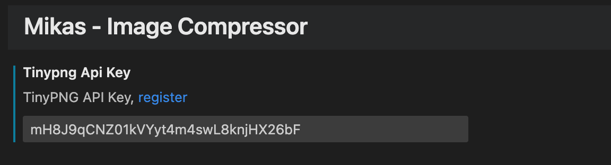

# Mikas - Image Compressor

A Visual Studio Code plugin to helps you to compress commonly used image formats faster and better.

The following common image formats are supported:

- JPG/JPEG
- PNG
- WebP
- SVG

Function implementation based on:

- [tinypng](https://tinypng.com/)
- [SVGO](https://github.com/svg/svgo)

## How to Use

In order to use the full feature, you need to [register the tinypng API Key](https://tinypng.com/developers) and enter it in the Vs Code Settings:

