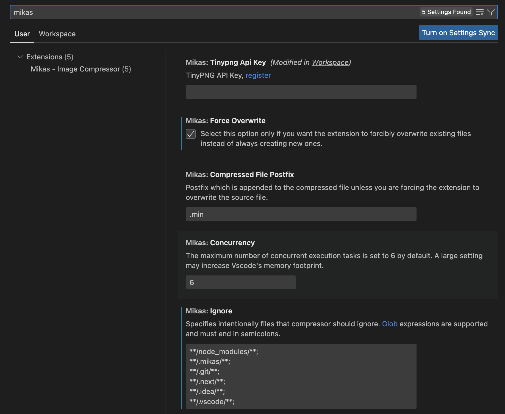

<div align="center">

<h1>Mikas - Image Compressor</h1>
</div>

A Visual Studio Code plugin to helps you to compress commonly used image formats faster and better.

The following common image formats are supported:

- JPG/JPEG
- PNG
- WebP
- SVG

Function implementation based on:

- [tinypng](https://tinypng.com/)
- [SVGO](https://github.com/svg/svgo)

## Introduce

**Beginning**


**Compress**


**Saved**


**Error**


Notes: Please make sure that the network connection is normal before use, because Tinypng API Key verification and compression require network requests, but svg files will be processed locally and will not consume traffic.

## How to Use

**Compress the entire workspace**


**Compress the selected files and directories**


## Configuration



On the extension settings page, compressor supports the following configurations：

### Tinypng Api Key(required)

The API Key is checked before each use, [register](https://tinypng.com/developers).

### Force Overwrite

Select this option only if you want the extension to forcibly overwrite existing files instead of always creating new ones. Default value is false.

### Compressed File Postfix

Postfix which is appended to the compressed file unless you are forcing the extension to overwrite the source file. Default value is ".min".

### Concurrency

The maximum number of concurrent execution tasks is set to 6 by default. A large setting may increase Vscode's memory footprint.

### Ignore

Specifies intentionally files that compressor should ignore. [Glob](<https://en.wikipedia.org/wiki/Glob_(programming)>) expressions are supported and must end in semicolons.

Default Values：

```
**/node_modules/**;
**/.mikas/**;
**/.git/**;
```

## Issues Report

[GitHub Issues](https://github.com/Jalen-Lee/Mikas/issues)

## Release Notes

Release notes can be found in the [changelog](https://github.com/Jalen-Lee/Mikas/blob/main/CHANGELOG.md).

**Enjoy!**
