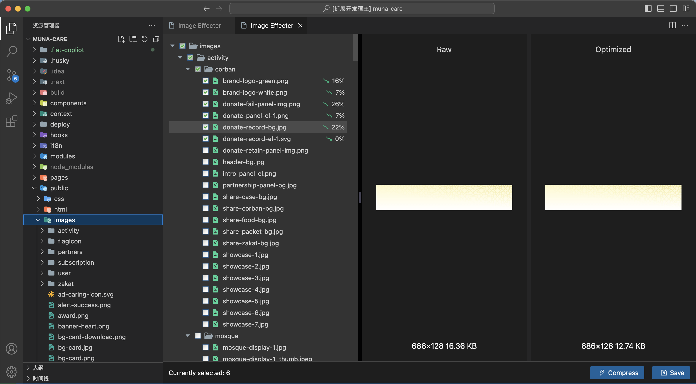
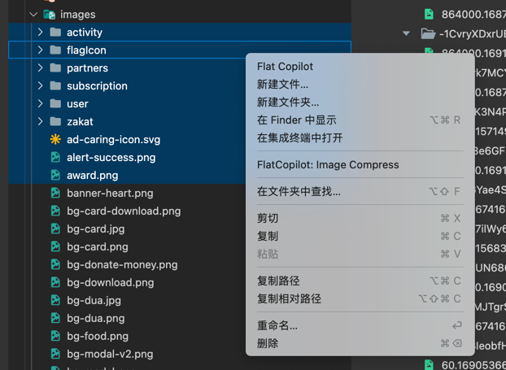
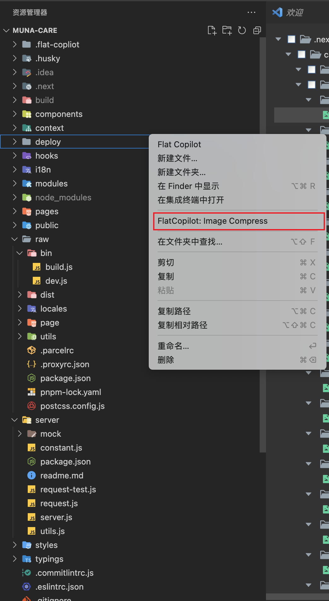
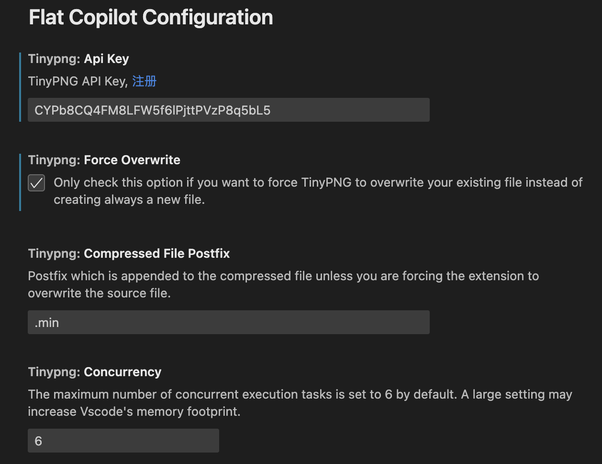

# Image Effecter

Vs Code 图片压缩优化模块，支持图片格式：

- PNG
- JPG/JPEG
- WebP
- SVG

## 使用方式

### 选中文件或者目录

### 选中工作空间

## Vs Code 配置

### Tinypng API Key

PNG、JPG/JPEG、WebP 的图片优化会使用 Tinypng API 进行处理，只需要邮箱即可[注册](https://tinypng.com/developers)，免费用户
每月有 500 额度，SVG 图片则在本地进行处理。

### 强制重写

插件会在工作空间内生成`.flat-coploot`目录用来临时存放处理好的图片，处理好的图片可以选择是否强制覆盖原图，或者作为副本保存到原图目录内。

### 已优化图片的后缀

默认情况下，优化处理好的图片会以`.min`作为名称后缀

### 任务并发数

当有大量图片需要处理时，需要发送大量请求，这样会增加 VsCode 的内存占用负担，同时也会使得插件主进程和本模块的 Webview 进程间通信阻塞卡顿。
通过设置任务并发数，控制任务的最大可用批处理数量。
